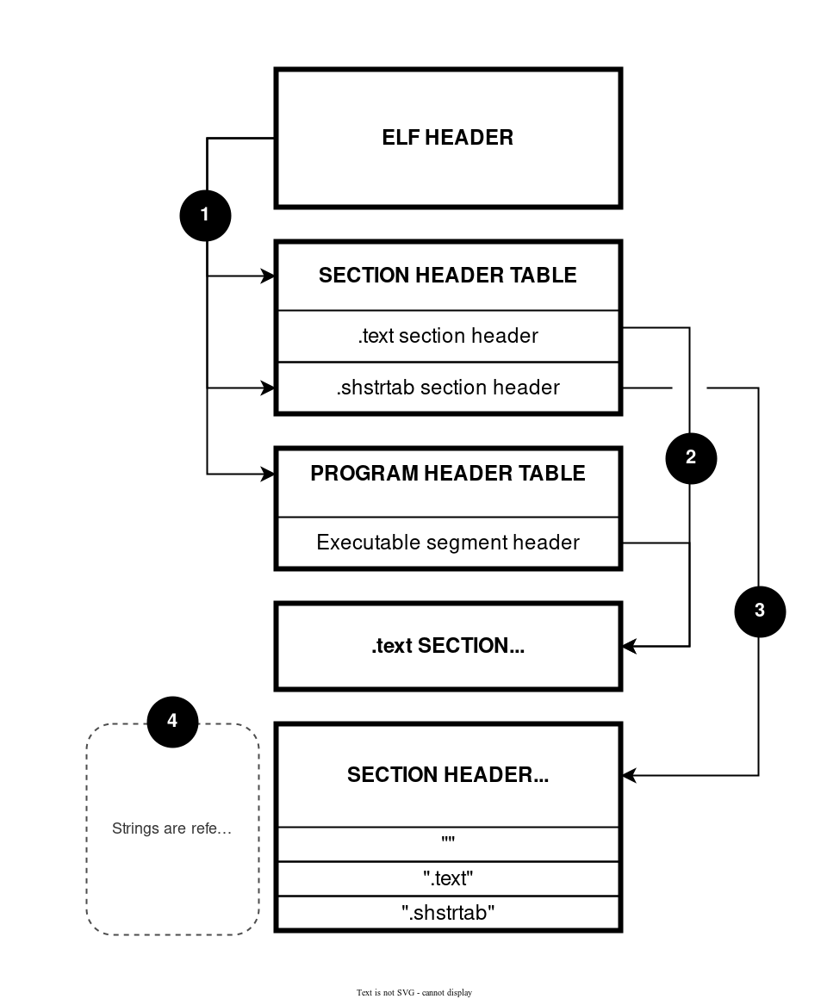
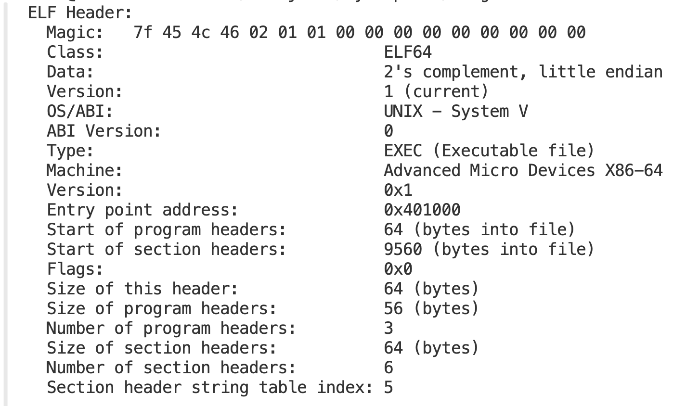
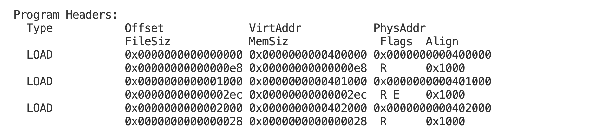

# Компилятор

## Установка

```
git clone https://github.com/d3clane/Compiler.git
cd Src 
make buildDirs && make
```

## Цель работы

В конце прошлого семестра был написан мой собственный [язык программирования](https://github.com/d3clane/ProgrammingLanguage). Для исполнения написанных программ код сначала преобразовывался в AST, а затем дампился в ассемблер для моей [эмуляции процессора](https://github.com/d3clane/Processor-Emulator). К сожалению, исполнение на эмулированном процессоре занимает больше времени, чем на реальном. Итак, основная цель работы - увеличение производительности написанного на моем языке кода. Для этого надо сразу преобразовывать в код, который сможет исполняться на нативной архитектуре - в данном случае x86_64. 

Работа разделена на два этапа:
1. AST дампится в ассемблер под x86_64 (в моем случае nasm), а затем elf64 файл уже генерируется с помощью nasm. 
2. Внутри программы кодирую нужным образом инструкции под x86_64, а затем создаю собственный elf64 файл.

## Архитектура компилятора

1. Компилятор получает на вход AST.
2. AST переводится в [IR](#Промежуточное-представление) - intermediate representation.
3. Из IR происходит дамп в исполняемый на x86_64 файл. 

Важно отметить, что арифметико-логические реализованы с помощью SSE инструкций. Благодаря этому, например, появляется возможность писать программу для решения квадратного уравнения на моем языке.

## Промежуточное представление

Intermediate representation(промежуточное представление) - структура данных, которая используется, чтобы представлять исходный код. В моем случае IR - двусвязный список, в котором хранятся инструкции, подобные ассемблерным. Структура одного элемента IR:

```
struct IRNode
{
    IROperation operation;          // Ассемблер-подобная инструкция (mov, pop, ...)
    char*       labelName;          // Имя метки. Какая-то нода может быть просто меткой

    size_t    numberOfOperands;     // Количество операндов у операции
    IROperand operand1;             // Первый операнд
    IROperand operand2;             // Второй операнд

    IRNode* jumpTarget;             // Куда указывает метка внутри 'JCC' или 'CALL'

    bool needPatch;                 // Нужно ли высчитывать jumpTarget на втором проходе создания IR

    size_t asmCmdBeginAddress;      // Адрес начала этой инструкции при переводе в ассемблер
    size_t asmCmdEndAddress;        // Адрес конца этой инструкции при переводе в ассемблер

    IRNode* nextNode;               // Указатель на следующую вершину
    IRNode* prevNode;               // Указатель на предыдущую вершину
};
```

Во-первых, такое промежуточное представление может быть использовано для оптимизаций. Например, в таком представлении хорошо видны последовательные `PUSH` / `POP`. Часто в таких случаях можно отказаться от использования стека. Как раз из-за того, что нужно удобно и быстро заменять инструкции в IR, удалять какие-то, вставлять новые, используется двусвязный список. На данный момент никакие оптимизации не применяются. 

Во-вторых, IR полезен, когда необходимо создавать исполняемый код под разные архитектуры. Так, не придется для каждой конкретной архитектуры писать общие оптимизации заново - все они могут быть произведены на стадии промежуточного представления, а значит, нужно будет написать только перевод из IR в инструкции для новой архитектуры, а также, возможно, какие-то специализированные под нее оптимизации.

В-третьих, с помощью IR можно удобно вычислить, куда указывает какой-нибудь `jmp`(`jcc`) или `call`. Для этого используется указатель `jumpTarget`.

## Дамп в nasm

Фактически, это не сложнее, чем то, что уже было мной написано для перевода в ассемблер моего эмулированного процессора. Основные отличия моего процессора:

- Произведение всех операций на стеке. То есть, например, арифметико-логические инструкции берут операнды со стека.
- Использование двух стеков - один стек для операций, другой для адресов возврата.
- Наличие оперативной памяти - некоторой области, в которой можно хранить локальные / глобальные переменные.

При переводе в код под x64 я отказался от использования двух стеков и оперативной памяти - локальные переменные и адреса возврата будут храниться на основном стеке.

## Кодирование инструкций 

Чтобы отказаться от nasm, необходимо понять, как самому закодировать инструкции. Информацию про это я брал с этого сайта: https://wiki.osdev.org/X86-64_Instruction_Encoding. 

На данный момент при кодировании инструкций, в которых используется какое-то константное значение, под него всегда выделяется максимальное число байт. То есть, например, если есть инструкция `PUSH IMM`, это всегда кодируется, как `PUSH IMM32` независимо от реального размера IMM.

Также поддерживается довольно ограниченное количество инструкций, которые получается закодировать - в основном это только те, которые могут на данный момент создаваться при дампе из IR в x64.

## Создание elf64 файла

Изучим структуру elf64 файла:



Src:https://scratchpad.avikdas.com/elf-explanation/elf-explanation.html

В моем случае меня интересует минимально возможный корректный elf64 файл. Для этого мне необходимы:

- Elf header. Заголовок elf файла с общей информацией о нем.
- Program header table. Заголовки, которые содержат информацию про различные области, где записаны какие-то данные / код, которые необходимо загрузить в память при исполнении программы. В моем случае у меня 3 различных header'а. 
- Сами данные / код, хранящиеся внутри elf файла. На картинке это `.text SECTION`. В моем elf файле будет 3 таких секции. 

### Elf header 

Заголовок elf файла содержит общую информацию про исполняемый файл, чтобы он корректно загружался в память. Как видно, в нем указано, что у меня в бинарнике 3 программных заголовка, а точка входа - сгенерированный программой код.

```
static const Elf64_Ehdr ElfHeader = 
{
    .e_ident = 
    {
        ELFMAG0, ELFMAG1, ELFMAG2, ELFMAG3, // Magic 
        ELFCLASS64,                         // 64-bit system
        ELFDATA2LSB,                        // Little-endian
        EV_CURRENT,                         // Version = Current(1)
        ELFOSABI_SYSV,                      // Unix SYSTEM V
        0                                   // filling other part with zeroes
    },

    .e_type    = ET_EXEC,                   // executable
    .e_machine = EM_X86_64,                 // x86_64
    .e_version = EV_CURRENT,                // current version

    .e_entry   = (Elf64_Addr)SegmentAddress::PROGRAM_CODE,
    .e_phoff    = sizeof(Elf64_Ehdr),          // program header table right after elf header

    .e_shoff    = 0,                           // segment header table offset - not used

    .e_flags    = 0,                           // no flags
    .e_ehsize   = sizeof(Elf64_Ehdr),	       // header size

    .e_phentsize = sizeof(Elf64_Phdr),         // program header table one entry size
    .e_phnum     = 3,                          // Number of program header entries.

    .e_shentsize = sizeof(Elf64_Shdr),         // section header size in bytes
    .e_shnum     = 0,                          // number of entries in section header table (not used)
    .e_shstrndx  = SHN_UNDEF,                  // no section header string table
};
```

Три различных программных заголовка - 

1. Заголовок стандартной библиотеки, которая необходима, чтобы работали функции ввода, вывода, завершения программы.
2. Rodata, где хранятся строчки и константные значения чисел с плавающей запятой.
3. Код, сгенерированный моей программой.

### Заголовок стандартной библиотеки

```
static const Elf64_Phdr StdLibPheader = 
{
    .p_type   = PT_LOAD,             
    .p_flags  = PF_R | PF_X,                             // read and execute
    .p_offset = (Elf64_Off) SegmentFilePos::STDLIB_CODE, // code offset in file
    .p_vaddr  = (Elf64_Addr)SegmentAddress::STDLIB_CODE, // virtual addr
    .p_paddr  = (Elf64_Addr)SegmentAddress::STDLIB_CODE, // physical addr

    // Can't specify at this moment
    .p_filesz = 0,                                       // number of bytes to load from file
    .p_memsz  = 0,                                       // number of bytes to load in mem

    .p_align  = 0x1000,                                  // 1 page alignment
};
```

Стандартная библиотека подгружается из заранее сгенерированного elf файла. Принцип, по которому это происходит объяснен [ниже](#Стандартная-библиотека).

### Заголовок rodata

```
static const Elf64_Phdr RodataPheader = 
{
    .p_type   = PT_LOAD,             
    .p_flags  = PF_R,                               // read
    .p_offset = (Elf64_Off) SegmentFilePos::RODATA, // code offset in file
    .p_vaddr  = (Elf64_Addr)SegmentAddress::RODATA, // virtual addr
    .p_paddr  = (Elf64_Addr)SegmentAddress::RODATA, // physical addr

    // Can't specify at the moment
    .p_filesz = 0,                                  // number of bytes to load from file
    .p_memsz  = 0,                                  // number of bytes to load in mem

    .p_align  = 0x1000,                             // 1 page alignment
};
```

Rodata предназначена для хранения констант, а потому в поле `p_flags` выставлены права только на чтение.

### Заголовок сгенерированного кода

static const Elf64_Phdr ProgramCodePheader = 
{
    .p_type   = PT_LOAD,             
    .p_flags  = PF_R | PF_X,                              // read and execute
    .p_offset = (Elf64_Off) SegmentFilePos::PROGRAM_CODE, // code offset in file
    .p_vaddr  = (Elf64_Addr)SegmentAddress::PROGRAM_CODE, // virtual addr
    .p_paddr  = (Elf64_Addr)SegmentAddress::PROGRAM_CODE, // physical addr

    // Can't specify at this moment
    .p_filesz = 0,                                        // number of bytes to load from file
    .p_memsz  = 0,                                        // number of bytes to load in mem

    .p_align  = 0x1000,                                   // 1 page alignment
};


Важно отметить, что в каждом из представленных заголовков поля `p_filesz` и `p_memsz` изначально пустые. Дело в том, что заранее неизвестно, сколько именно байт придется писать в файл (конечно, для кода стандартной библиотеки это заранее известно, но такой константы в коде я решил не заводить). Таким образом эти поля заполняются только после того, как станет уже точно известно, сколько байт занимает конкретный сегмент. 

### Стандартная библиотека

Формат elf файла из которого подгружается стандартная библиотека можно увидеть с помощью readelf:





Для копирования стандартной библиотеки в бинарник мне необходимы программные заголовки `.text` и `.rodata`, а также соответствующие им данные/код. Важно, что внутри есть адресация между сегментами (`.text` адресуется к `.rodata`). То есть, чтобы не сломать эту адресацию, надо загружать эти сегменты в те же области памяти. В нашем случае получается, что код стандартной библиотеки будет загружаться по адресу `0x401000`, а rodata по `0x402000`. Если же адресация относительная, а не абсолютная, то достаточно просто сохранить расположение этих сегментов друг относительно друга в памяти. 

## Генерация кода

Во время генерации кода появляется проблема с такими инструкциями, как `call`, `jcc`. Благодаря IR я знаю, на какую инструкции ссылаются они (`jumpTarget`), но, фактически, адрес этой инструкции может быть еще не подсчитан, так как программа до нее еще не дошла. Чтобы разрешить подобные проблемы, используется двухпроходная компиляция - на второй проход все адреса уже точно известны.

## Сравнение производительности

Вернемся к основной цели работы - ускорение. Напишем две программы:

1. В цикле какое-то количество раз считаем факториал 6. 
2. Аналогично в цикле вычисляются корни квадратного уравнения $x^2+5x-7=0$

На моей эмуляции процессора будем выполнять действия в цикле $10^7$ раз, а в скомпилированном под x86_64 бинарнике $10^8$ раз. Время меряется с помощью time и исчисляется в секундах.

Эмулированный процессор компилируется с флагами `-Ofast -D NDEBUG` и с выключением логирования, канареек, хеширования и тд.

Запуск на эмуляции процессора:

|           | 1 запуск  | 2 запуск  | 3 запуск | Среднее        | Среднее на $10^7$ циклов      |
|:---:      |:---:      |:---:      |:---:     |:---:           |:---:                          | 
| Факториал | 11.478    | 11.580    | 12.032   | $11.7 \pm 0.3$ | $11.7 \pm 0.3$              |
| Квадратка | 16.863    | 16.498    | 16.409   | $16.6 \pm 0.2$ | $16.6 \pm 0.2$              |

Запуск сгенерированного бинарника:

|           | 1 запуск | 2 запуск  | 3 запуск | Среднее         | Среднее на один цикл          |
|:---:      |:---:     |:---:      |:---:     |:---:            |:---:                          | 
| Факториал | 5.911    |  6.290    | 5.937    | $6.1 \pm 0.2$   | $0.61 \pm 0.02$             |
| Квадратка | 7.563    |  6.639    | 7.396    | $7.2 \pm 0.5$   | $0.72 \pm 0.05$             |

Сравнение:

|           | $10^7$ циклов x64 | $10^7$ циклов эмуляция | Ускорение        |
|:---:      |:---:              |:---:                   |:---:             |
| Факториал |$0.61 \pm 0.02$    |$11.7 \pm 0.3$          | $19.2 \pm 1.1$   |
| Квадратка |$0.72 \pm 0.05$    |$16.6 \pm 0.2$          | $23.1 \pm 1.9$   |

Очень значительный выигрыш в производительности - аж в 20 раз. При этом ускорение для решения квадратного уравнения больше. Возможно, это из-за того, что при эмуляции процессора используются вычисления с фиксированной точностью. При взятии корня необходимо сначала перевести целое число в xmm регистр, взять корень, вернуть в исходный регистр и сделать нужное домножение для сохранения точности. В то время как под x64 все вычисления сразу выполняются на xmm регистрах. При подсчете факториала такого фактора нет - там нигде не берется корень. 

Итак, исполнение программы на нативной архитектуре вместо эмулятора ускорило время работы в более чем 20 раз, а значит цель работы достигнута. 